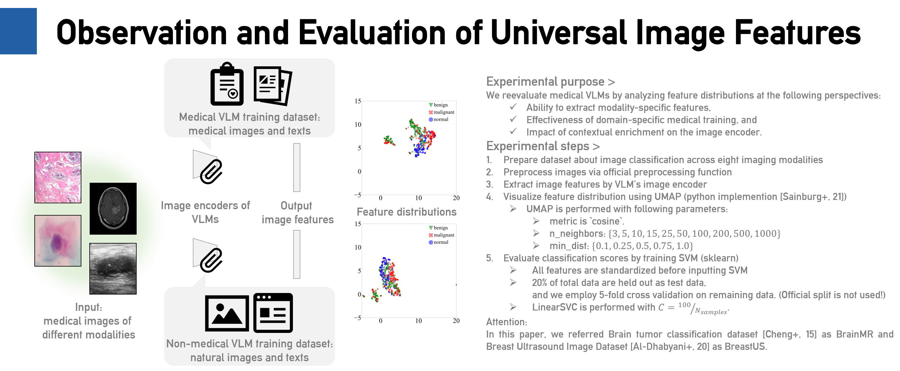

# MedicalVLM-matching
## About this repository
This repository is supplementally results of our poster presentation at IFMIA2025, “Do medical VLMs discover discriminative features in multi-modal medical images?".
Corresponding poster is [available](./IF250081.pdf)!

## Abstract
This study investigates the feature representations produced by publicly available open source medical vision-language models (VLMs). VLMs are deep learning models trained on large scale datasets to embed images and texts into their respective universal feature spaces. Medical VLMs have been developed to capture sophisticated feature representations, but their learned feature representations remain underexplored. Understanding these representations is crucial for revealing medical image structures and improving downstream tasks in medical image analysis.

This study aims to investigate the feature distributions learned by medical VLMs and evaluate the impact of medical specialization. We analyze the feature distribution of multiple image modalities extracted by some representative medical VLMs across lesion classification datasets on multiple modalities. These distributions were compared them with non-medical VLMs to assess the domain-specific medical training. Our experiments showed that medical VLMs can extract discriminative features that are effective for medical classification tasks. Moreover, it was found that non-medical VLMs with recent improvement with contextual enrichment such as LLM2CLIP produce more refined feature representations.

Our results imply that enhancing text encoder is more crucial than training intensively on medical images when developing medical VLMs. Notably, non-medical models are particularly vulnerable to biases introduced by overlaied text strings on images. These findings underscore the need for careful consideration on model selection according to downstream tasks besides potential risks in inference due to background biases such as textual information in images.

### Findings via Observation
#### The VLMs are aware of the tumor and its malignancy!
TBW

#### Background biases affected the feature distributions!
TBW

#### Medical specialization doesn’t specialize image encoders
TBW

#### The VLMs are discriminative on tumor subtypes.
TBW

#### Negative effect of pre-training on PMC-15M
TBW

### Evaluation by SVM Classifiers
model name | Backbone | [Brain MR](https://www.kaggle.com/datasets/sartajbhuvaji/brain-tumor-classification-mri)   $n=2,870$ |  $2$ classes  | [SARS-COV-2 CTscan](https://www.kaggle.com/datasets/plameneduardo/sarscov2-ctscan-dataset)   $n=2,481$ |   $2$ classes | [PneumoniaMNIST](https://medmnist.com/)  $n=4,708$ |   $2$ classes| [BreastUS](https://www.kaggle.com/datasets/aryashah2k/breast-ultrasound-images-dataset)  $n=780$| $3$ classes| [BreakHis](https://web.inf.ufpr.br/vri/databases/breast-cancer-histopathological-database-breakhis/)  $n=7,909$| $2$ classes| [HiCervix](https://github.com/Scu-sen/HiCervix)  $n=28,160$| $29$ classes| [DeepDRiD](https://github.com/deepdrdoc/DeepDRiD)  $n=1,200$| $5$ classes| [ISIC2019](https://challenge.isic-archive.com/landing/2019/)  $n=25,331$| $9$ classes|
| :-: | :-: | :-: | :-: | :-: | :-: | :-: | :-: | :-: | :-: | :-: | :-: | :-: | :-: | :-: | :-: | :-: | :-: |
|  |  | Accuracy | F1-score | Accuracy | F1-score | Accuracy | F1-score | Accuracy | F1-score | Accuracy | F1-score | Accuracy | F1-score | Accuracy | F1-score | Accuracy | F1-score |
**Medical VLMs**|
[BiomedCLIP](https://arxiv.org/abs/2303.00915) | [B-16](https://huggingface.co/microsoft/BiomedCLIP-PubMedBERT_256-vit_base_patch16_224) | $91\pm 0.2\%^\dagger$ | $91\pm 0.2\%^\dagger$ | $89\pm 0.5\%^\dagger$ |  $89\pm 0.5\%^\dagger$ | $97\pm 0.4\%^\dagger$ | **$97\pm 0.5\%^\dagger$** | $91\pm 0.2\%^\dagger$ | $91\pm 0.2\%^\dagger$ | $83\pm 0.8\%^\dagger$ | $87\pm 0.7\%^\dagger$ | $49\pm 0.2\%^\dagger$ | $41\pm 0.2\%^\dagger$ | $63\pm 0.6\%^{u}$ | $42\pm 3.9\%^{u}$ | $68\pm 0.1\%^\dagger$ | $38\pm 0.2\%^\dagger$ |
[LLaVA-Med](https://arxiv.org/abs/2306.00890) | [L/14-336](https://huggingface.co/microsoft/llava-med-v1.5-mistral-7b) | $93\pm 0.4\%^\dagger$ | $94\pm 0.4\%^\dagger$ | $95\pm 0.5\%^\dagger$ | $95\pm 0.5\%^\dagger$ | $96\pm 0.3\%^\dagger$ | $95\pm 0.4\%^\dagger$ | $93\pm 0.4\%^\dagger$ | $94\pm 0.4\%^\dagger$ | $86\pm 0.9\%^\dagger$ | $89\pm 0.8\%^\dagger$ | $61\pm 0.2\%^\dagger$ | $57\pm 0.5\%^\dagger$ | $67\pm 1.1\%^{u}$ | $49\pm 0.8\%^{u}$ | **$77\pm 0.2\%^\dagger$** | **$64\pm 1.1\%^\dagger$** |
[LLaVA-Med++](https://arxiv.org/abs/2408.02900) | [L/14-336](https://github.com/UCSC-VLAA/MedTrinity-25M) | $93\pm 0.4\%^\dagger$ | $94\pm 0.5\%^\dagger$ | $94\pm 0.1\%^\dagger$ | $94\pm 0.1\%^\dagger$ | $96\pm 0.5\%^\dagger$ | $95\pm 0.6\%^\dagger$ | $93\pm 0.4\%^\dagger$ | $94\pm 0.5\%^\dagger$ | $86\pm 1.3\%^\dagger$ | $89\pm 1.2\%^\dagger$ | $62\pm 0.4\%^\dagger$ | $57\pm 0.5\%^\dagger$ | $68\pm 1.6\%^{u}$ | $51\pm 2.4\%^{u}$ | **$77\pm 0.2\%^\dagger$** | $63\pm 1.0\%^\dagger$ |
|**Modality-specific VLMs**|
[CXR-CLIP](https://link.springer.com/chapter/10.1007/978-3-031-43895-0_10) | [SwinT](https://github.com/Soombit-ai/cxr-clip) | $86\pm 0.4\%$ | $86\pm 0.5\%$ | $79\pm 0.6\%$ | $79\pm 0.6\%$ | $93\pm 0.6\%$ | $90\pm 0.7\%$ | $86\pm 0.4\%$ | $86\pm 0.5\%$ | $80\pm 0.9\%$ | $85\pm 0.5\%$ | $45\pm 0.1\%$ | $37\pm 0.1\%$ | $61\pm 1.9\%$ | $34\pm 4.0\%$ | $60\pm 0.1\%$ | $25\pm 0.3\%$ |
[CONCH](https://www.nature.com/articles/s41591-024-02856-4) | [ViT (CoCa)](https://github.com/mahmoodlab/CONCH) | $91\pm 0.9\%$ | $91\pm 0.9\%$ | $88\pm 0.5\%$ | $88\pm 0.5\%$ | $95\pm 0.2\%$ | $94\pm 0.3\%$ | $91\pm 0.9\%$ | $91\pm 0.9\%$ | $89\pm 0.4\%^\dagger$ | $91\pm 0.3\%^\dagger$ | $57\pm 0.3\%$ | $51\pm 0.4\%$ | $64\pm 1.9\%$ | $45\pm 2.9\%$ | $71\pm 0.2\%$ | $44\pm 0.3\%$ |
[UNI](https://www.nature.com/articles/s41591-024-02857-3) | [B/16](https://github.com/mahmoodlab/UNI) | $93\pm 0.3\%$ | $93\pm 0.3\%$ | $93\pm 0.4\%$ | $93\pm 0.4\%$| $97\pm 0.2\%$ | $96\pm 0.2\%$ | $93\pm 0.3\%$ | $93\pm 0.3\%$ | **$91\pm 0.8\%^\dagger$** | **$93\pm 0.6\%^\dagger$** | **$65\pm 0.2\%$** | **$62\pm 0.2\%$** | $69\pm 1.0\%$ | $49\pm 2.1\%$ | $74\pm 0.3\%$ | $57\pm 0.6\%$|
[FLAIR](https://arxiv.org/abs/2308.07898) | [ResNet50](https://github.com/jusiro/FLAIR) | $84\pm 0.4\%$ | $84\pm 0.3\%$ | **$96\pm 0.4\%$** | **$96\pm 0.4\%$** | $98\pm 0.2\%$ | $97\pm 0.2\%$ | $76\pm 1.1\%$ | $70\pm 1.6\%$| $82\pm 0.9\%$ | $87\pm 0.5\%$ |  $44\pm 0.2\%$ | $35\pm 0.1\%$ | $70\pm 0.8\%$ | **$59\pm 2.0\%$** | $62\pm 0.1\%$ | $25\pm 0.4\%$|
**non-medical VLMs** | 
[CLIP](https://arxiv.org/abs/2103.00020) | [B/16](https://github.com/mlfoundations/open_clip) | $92\pm 0.7\%$ | $92\pm 0.7\%$ | $92\pm 0.4\%$ | $92\pm 0.4\%$| $97\pm 0.4\%$ | $96\pm 0.5\%$ | $92\pm 0.7\%$ | $92\pm 0.7\%$ | $84\pm 1.0\%$ | $88\pm 0.7\%$ | $57\pm 0.3\%$ | $52\pm 0.4\%$ | $61\pm 1.3\%$ | $34\pm 2.7\%$ | $71\pm 0.2\%$ | $45\pm 0.4\%$ |
|| [L/14](https://github.com/mlfoundations/open_clip) | $91\pm 0.6\%$ | $92\pm 0.6\%$ | $89\pm 0.8\%$ | $89\pm 0.8\%$| $97\pm 0.1\%$ | $96\pm 0.1\%$ | $91\pm 0.6\%$ | $92\pm 0.6\%$ | $86\pm 0.6\%$ | $89\pm 0.5\%$ | $59\pm 0.2\%$ | $54\pm 0.3\%$ | $66\pm 0.9\%$ | $46\pm 2.1\%$ | $73\pm 0.1\%$ | $53\pm 0.9\%$ |
|| [G/14](https://github.com/mlfoundations/open_clip) | $90\pm 0.7\%$ | $90\pm 0.7\%$ | $93\pm 0.5\%$ | $93\pm 0.5\%$| $97\pm 0.3\%$ | $96\pm 0.4\%$ | $90\pm 0.7\%$ | $90\pm 0.7\%$ | $86\pm 0.9\%$ | $89\pm 0.8\%$ | $59\pm 0.2\%$ | $53\pm 0.3\%$ | $63\pm 1.2\%$ | $41\pm 2.3\%$ | $73\pm 0.3\%$ | $55\pm 0.8\%$ |
[EVA02](https://arxiv.org/abs/2303.11331) | [L/14-336](https://github.com/mlfoundations/open_clip) | $93\pm 0.3\%$ | $93\pm 0.3\%$ | $94\pm 0.6\%$ | $94\pm 0.6\%$| $98\pm 0.3\%$ | $97\pm 0.4\%$ | $93\pm 0.3\%$ | $93\pm 0.3\%$ | $86\pm 0.4\%$ | $89\pm 0.3\%$ | $61\pm 0.3\%$ | $54\pm 0.5\%$ | $55\pm 0.0\%$ | $14\pm 0.0\%$ | $75\pm 0.1\%$ | $55\pm 0.7\%$ |
[LLaVA](https://llava-vl.github.io/) | [Mistral-7b](https://huggingface.co/llava-hf/llava-v1.6-mistral-7b-hf) | $92\pm 0.5\%$ | $93\pm 0.5\%$ | $94\pm 0.5\%$ | $94\pm 0.5\%$| **$98\pm 0.5\%$** | $97\pm 0.6\%$ | $92\pm 0.5\%$ | $93\pm 0.5\%$   | $86\pm 0.7\%$ | $89\pm 0.6\%$ | $62\pm 0.3\%$ | $56\pm 0.5\%$ | $68\pm 2.8\%$ | $50\pm 2.4\%$ | $76\pm 0.1\%$ | $61\pm 0.6\%$ |
| | [Vicuna-13B](https://huggingface.co/liuhaotian/llava-v1.6-vicuna-13b) | $92\pm 0.3\%$ | $93\pm 0.2\%$ | $93\pm 0.8\%$ | $93\pm 0.8\%$| $96\pm 0.5\%$ | $95\pm 0.6\%$ | $92\pm 0.3\%$ | $93\pm 0.2\%$   | $86\pm 1.2\%$ | $89\pm 1.0\%$ | $62\pm 0.2\%$ | $57\pm 0.4\%$ | $67\pm 2.1\%$ | $49\pm 2.2\%$ | $77\pm 0.2\%$ | $62\pm 0.7\%$ |
[LLM2CLIP](https://arxiv.org/abs/2411.04997) | [L/14-336](https://huggingface.co/microsoft/LLM2CLIP-Openai-L-14-336) | **$94\pm 0.3\%$** | **$95\pm 0.3\%$** | $94\pm 0.4\%$ | $94\pm 0.4\%$| $97\pm 0.3\%$ | $96\pm 0.4\%$ | **$94\pm 0.3\%$**| **$95\pm 0.3\%$**   | $88\pm 0.8\%$ | $91\pm 0.6\%$ | $63\pm 0.3\%$ | $57\pm 0.5\%$ | **$71\pm 1.6\%$** | $55\pm 2.5\%$ | $76\pm 0.2\%$ | $61\pm 0.5\%$ |
**non VLMs** |  |  |  |  |  | |
[VGG16](https://arxiv.org/abs/1409.1556) | [VGG16](https://pytorch.org/vision/main/models/generated/torchvision.models.vgg16.html) | $83\pm 1.1\%$ | $83\pm 1.2\%$ | $88\pm 0.2\%$ | $88\pm 0.2\%$| $94\pm 0.3\%$ | $93\pm 0.5\%$ | $83\pm 1.1\%$ | $83\pm 1.2\%$   | $84\pm 0.8\%$ | $87\pm 0.7\%$ | $44\pm 0.3\%$ | $37\pm 0.2\%$ | $56\pm 1.4\%$ | $27\pm 0.9\%$ | $63\pm 0.2\%$ | $34\pm 0.9\%$ |
[ResNet50](https://arxiv.org/abs/1512.03385) | [ResNet50](https://pytorch.org/vision/main/models/generated/torchvision.models.resnet50.html) | $85\pm 0.9\%$ | $85\pm 1.1\%$ | $91\pm 0.3\%$ | $91\pm 0.3\%$| $97\pm 0.3\%$ | $96\pm 0.4\%$ | $85\pm 0.9\%$ | $85\pm 1.1\%$   | $84\pm 0.8\%$ | $87\pm 0.7\%$ | $48\pm 0.2\%$ | $43\pm 0.1\%$ | $48\pm 1.6\%$ | $30\pm 1.8\%$ | $67\pm 0.4\%$ | $47\pm 1.0\%$ |
[ViT-L/16](https://arxiv.org/abs/2010.11929) | [ViT-L/16](https://pytorch.org/vision/main/models/generated/torchvision.models.vit_l_16.html) | $89\pm 0.8\%$ | $89\pm 0.8\%$ | $92\pm 0.5\%$ | $92\pm 0.5\%$| $98\pm 0.2\%$ | $97\pm 0.3\%$ | $89\pm 0.8\%$ | $89\pm 0.8\%$   | $85\pm 0.8\%$ | $88\pm 0.6\%$ | $52\pm 0.2\%$ | $47\pm 0.3\%$ | $47\pm 1.3\%$ | $28\pm 1.9\%$ | $69\pm 0.3\%$ | $51\pm 0.6\%$ |

## Survey results
### Dataset about image classification across various modalities
|dataset name|dataset portal|task|modality|DOI of dataset|remarks|
|:-|:-|:-|:-|:-|:-|
|Brain tumor dataset|[figshare](https://doi.org/10.6084/m9.figshare.1512427.v8)|classification +detection|MRI|10.1371/journal.pone.0140381|This dataset includes images on three imaging plane: axial, coronal, sagital.|
|Brain tumor classification|[kaggle](https://www.kaggle.com/datasets/sartajbhuvaji/brain-tumor-classification-mri)|classification|MRI|10.34740/kaggle/dsv/1183165|
|CheXpert|[HP](https://stanfordmlgroup.github.io/competitions/chexpert/), [kaggle](https://www.kaggle.com/datasets/ashery/chexpert)|classification|X-ray|10.1609/aaai.v33i01.3301590|
|NIH Chest X-ray Dataset|[Kaggle](https://www.kaggle.com/datasets/nih-chest-xrays/data)|classification|X-ray||
|LIDC-IDRI|[TCIA](https://www.cancerimagingarchive.net/collection/lidc-idri/)|classification +detection|CT|10.7937/K9/TCIA.2015.LO9QL9SX|
|COVIDx CT|[kaggle](https://www.kaggle.com/datasets/hgunraj/covidxct)|classification|
|Breast Ultrasound Images Dataset|[kaggle](https://www.kaggle.com/datasets/aryashah2k/breast-ultrasound-images-dataset)|classification|US|10.1016/j.dib.2019.104863|
|DiagSet|https://ai-econsilio.diag.pl/|classification|histpathology|10.1038/s41598-024-52183-4|
|BreakHis|[Their HP](https://web.inf.ufpr.br/vri/databases/breast-cancer-histopathological-database-breakhis/)|classification|histpathology|10.1109/TBME.2015.2496264|
|HiCervix|[Zenodo](https://zenodo.org/records/11087263)|classification|histopathology|10.1109/TMI.2024.3419697|
|[Retinal-Datasets](https://github.com/lxirich/MM-Retinal)|[google drive](https://drive.google.com/drive/folders/177RCtDeA6n99gWqgBS_Sw3WT6qYbzVmy)|classification|retinal|10.1007/978-3-031-72378-0_67|

### VLMs
### Appendix: non-medical VLMs corresponding medical VLMs
|model name|year|dataset|image encoder|text encoder|paper|model URL|
|:-:|:-:|:-:|:-:|:-:|:-|:-|
|CLIP|Feb. 21|LAION?|ViT|BERT|[PLMR](https://proceedings.mlr.press/v139/radford21a)|[github](https://github.com/openai/CLIP)|
|CoCa|May. 22|JFT-3B and ALIGN|||[arXiv](https://arxiv.org/abs/2205.01917)|[github](https://github.com/lucidrains/CoCa-pytorch)|
|DINOv2|Apr. 23|LVD-142M|ViT||[arXiv](https://arxiv.org/abs/2304.07193)|[github](https://github.com/facebookresearch/dinov2?tab=readme-ov-file)|
|LLaVA|Apr. 23|CC-595K subset and LLaVA-Instruct-158K dataset|||[NeurIPS](https://proceedings.neurips.cc/paper_files/paper/2023/hash/6dcf277ea32ce3288914faf369fe6de0-Abstract-Conference.html), [CVPR2024](https://openaccess.thecvf.com/content/CVPR2024/html/Liu_Improved_Baselines_with_Visual_Instruction_Tuning_CVPR_2024_paper.html)|[github](https://github.com/haotian-liu/LLaVA)|
|LLM2CLIP|Nov. 24|ShareCaptioner modified CC-3M dataset, Wikitext-103 dataset and the E5 dataset|EVA ViT L/14-224|Mistral Nemo 12B with LoRA finetuning|[arXiv](https://arxiv.org/abs/2411.04997)|[github](https://github.com/microsoft/LLM2CLIP)|
|ALIGN|Feb. 21|[alt-text](https://www.mdpi.com/2076-3417/13/19/11103?utm_source=chatgpt.com)|EfficientNet|BERT|[arXiv](https://arxiv.org/abs/2102.05918)|[github](https://github.com/ALIGN-analoglayout/ALIGN-public)|

### CLIP based models
|model name|year|dataset|image encoder|text encoder|Modality|paper|model URL|
|:-:|:-:|:-:|:-:|:-:|:-|:-|:-|
|BiomedCLIP|Mar. 23|PMC-15M|CLIP-ViT-B-16|PubMedBERT|all|[arXiv](https://arxiv.org/abs/2303.00915)|[huggng face](https://huggingface.co/microsoft/BiomedCLIP-PubMedBERT_256-vit_base_patch16_224)|
|UniMedCLIP|Dec. 24|[UniMed](https://github.com/mbzuai-oryx/UniMed-CLIP/blob/main/docs/UniMed-DATA.md)|CLIP-ViT-L-16 and L-14|BioMed-BERT|all|[arXiv](https://arxiv.org/abs/2412.10372)|[github](https://github.com/mbzuai-oryx/UniMed-CLIP)|
|CXR-CLIP|Oct. 23|MIMIC-CXR,  CheXpert,  ChestX-ray14, RSNA pneumonia, SIIM Pneumothorax, VinDR-CXR,  Open-I|ResNet50 or SwinTransformer|BioClinicalBERT|X-ray|[MICCAI2023](https://link.springer.com/chapter/10.1007/978-3-031-43895-0_10)([arXiv](https://arxiv.org/abs/2310.13292))|[github](https://github.com/Soombit-ai/cxr-clip)|
|CONCH|Mar. 24|original (from PubMed)|CoCa based|CoCa based|histpathology|[nature medicine](https://www.nature.com/articles/s41591-024-02856-4)|[github](https://github.com/mahmoodlab/CONCH)|
|UNI|Mar. 24|Mass-100K (100K WSI) (over 75M images)|DINOv2|?|histpathology|[nature medicine](https://www.nature.com/articles/s41591-024-02857-3)|[github](https://github.com/mahmoodlab/UNI)|
|CHIEF|Sep. 24|original from [TCGA](https://www.cancer.gov/ccg/research/genome-sequencing/tcga), [GTEx](https://www.gtexportal.org/home/), PAIP, [PANDA](https://panda.grand-challenge.org/), BCC, BCNB, ACROBAT and TOC|original (CTransPath based)|CLIP|histpathology|[nature](https://www.nature.com/articles/s41586-024-07894-z)|[github](https://github.com/hms-dbmi/CHIEF)|
|CT-CLIP|Oct. 24|[CT-RATE](https://huggingface.co/datasets/ibrahimhamamci/CT-RATE)|3D transformer based on CT-ViT|CXR-Bert|CT (3D)|[arXiv](https://arxiv.org/abs/2403.17834)|[Hugging face](https://huggingface.co/datasets/ibrahimhamamci/CT-RATE)|
|CLIP-DR|Jul. 24|[GDR-Bench](https://github.com/chehx/DGDR/blob/main/GDRBench/README.md)|ResNet50|pre-trained Transformer|Retinopathy|[MICCAI2024](https://link.springer.com/chapter/10.1007/978-3-031-72378-0_62)([arXiv](https://arxiv.org/abs/2407.04068))|[github](https://github.com/Qinkaiyu/CLIP-DR)|
|VisionUnite|Aug. 24|[MMFundus](https://github.com/HUANGLIZI/MMFundus)|original (EVA02 and CLIP based)|llama-7B|Ophthalmology|[arXiv](https://arxiv.org/abs/2408.02865)|[github](https://github.com/HUANGLIZI/VisionUnite)|

### VQA based models
|model name|year|dataset|image encoder|text encoder|Modality|paper|model URL|
|:-:|:-:|:-:|:-:|:-:|:-|:-|:-|
|LLaVA-Med|Jun. 23|PMC-15M|CLIP-ViT-L/14-336|mistral-7b|all|[NeurIPS](https://proceedings.neurips.cc/paper_files/paper/2023/hash/5abcdf8ecdcacba028c6662789194572-Abstract-Datasets_and_Benchmarks.html)|[github](https://github.com/microsoft/LLaVA-Med)|
|MedTrinity|Aug. 24|[MedTrinity-25M](https://huggingface.co/datasets/UCSC-VLAA/MedTrinity-25M)|same as LLaVA-Med|same as LLaVA-Med|all|[arXiv](https://www.arxiv.org/abs/2408.02900)|[github](https://github.com/UCSC-VLAA/MedTrinity-25M)|
|PathChat|Jun.24|original from PubMed Open Access, |UNI|Llama2LLM|Pathology|[nature](https://www.nature.com/articles/s41586-024-07618-3)|[github](https://github.com/fedshyvana/pathology_mllm_training)

## survey source
|name|URL|
|:-|:-|
|Data-Centric Foundation Models in Computational Healthcare|https://github.com/openmedlab/Data-Centric-FM-Healthcare|
|A Survey of Publicly Available MRI Datasets for Potential Use in Artificial Intelligence Research|https://pubmed.ncbi.nlm.nih.gov/37888298/|
|A survey on lung CT datasets and research trends|https://link.springer.com/article/10.1007/s42600-021-00138-3|
|Awesome-Healthcare-Foundation-Models|https://github.com/Jianing-Qiu/Awesome-Healthcare-Foundation-Models|
|Medical Vision-and-Language Tasks and Methodologies: A Survey|https://github.com/YtongXie/Medical-Vision-and-Language-Tasks-and-Methodologies-A-Survey|
|Alzheimer's Disease Neuroimaging Initiative (ADNI)|https://pmc.ncbi.nlm.nih.gov/articles/PMC2809036/|
|Awesome Vision-Language Models (VLMs) for Medical Report Generation (RG) and Visual Question Answering (VQA)|https://github.com/lab-rasool/Awesome-Medical-VLMs-and-Datasets/tree/main|
